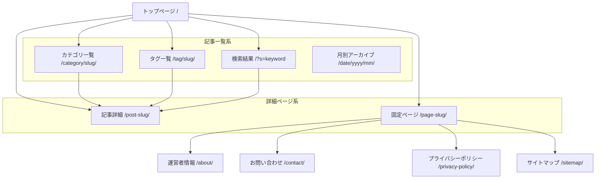

# LogiShift サイトマップ

## 構造図

## URL設計

| ページ種類 | URLパターン | 備考 |
| :--- | :--- | :--- |
| トップページ | `https://logishift.jp/` | |
| 記事詳細 | `https://logishift.jp/{post-slug}/` | 英単語のスラッグを推奨 |
| カテゴリ一覧 | `https://logishift.jp/category/{slug}/` | |
| タグ一覧 | `https://logishift.jp/tag/{slug}/` | |
| 固定ページ (汎用) | `https://logishift.jp/{slug}/` | |
| 運営者情報 | `https://logishift.jp/about/` | |
| お問い合わせ | `https://logishift.jp/contact/` | |
| プライバシーポリシー | `https://logishift.jp/privacy-policy/` | |
| サイトマップ | `https://logishift.jp/sitemap/` | |
| 検索結果 | `https://logishift.jp/?s={keyword}` | |
