# LogiShift サイトマップ

## 構造図

```mermaid
graph TD
    Home[トップページ /]
    
    subgraph Archives [記事一覧系]
        Cat[カテゴリ一覧 /category/slug/]
        Tag[タグ一覧 /tag/slug/]
        Search[検索結果 /?s=keyword]
        Date[月別アーカイブ /date/yyyy/mm/]
    end

    subgraph Categories [主要カテゴリ]
        Cat1[物流DX・トレンド /category/logistics-dx/]
        Cat2[倉庫管理・WMS /category/warehouse-management/]
        Cat3[輸配送・TMS /category/transportation/]
        Cat4[マテハン・ロボット /category/material-handling/]
        Cat5[サプライチェーン /category/supply-chain/]
        Cat6[事例・インタビュー /category/case-studies/]
        Cat7[海外トレンド /category/news-global/]
    end

    subgraph ThemeTags [課題別タグ]
        Tag1[コスト削減 /tag/cost-reduction/]
        Tag2[人手不足対策 /tag/labor-shortage/]
        Tag3[品質向上 /tag/quality-improvement/]
    end

    subgraph Regions [海外トレンド]
        Reg1[アメリカ /tag/usa/]
        Reg2[ヨーロッパ /tag/europe/]
        Reg3[中国 /tag/china/]
        Reg4[東南アジア /tag/southeast-asia/]
    end
    
    subgraph Singles [詳細ページ系]
        Post[記事詳細 /post-slug/]
        Page[固定ページ /page-slug/]
    end
    
    Home --> Cat
    Home --> Tag
    Home --> Search
    Home --> Post
    Home --> Page

    Cat --> Cat1
    Cat --> Cat2
    Cat --> Cat3
    Cat --> Cat4
    Cat --> Cat5
    Cat --> Cat6
    Cat --> Cat7

    Tag --> Tag1
    Tag --> Tag2
    Tag --> Tag3
    Tag --> Reg1
    Tag --> Reg2
    Tag --> Reg3
    Tag --> Reg4
    
    Cat1 --> Post
    Cat2 --> Post
    Cat3 --> Post
    Cat4 --> Post
    Cat5 --> Post
    Cat6 --> Post
    Cat7 --> Post
    
    %% 具体的な固定ページ
    Page --> About[運営者情報 /about/]
    Page --> Contact[お問い合わせ /contact/]
    Page --> Policy[プライバシーポリシー /privacy-policy/]
    Page --> Sitemap[サイトマップ /sitemap/]
```

## URL設計

| ページ種類 | URLパターン | 備考 |
| :--- | :--- | :--- |
| トップページ | `https://logishift.jp/` | |
| 記事詳細 | `https://logishift.jp/{post-slug}/` | 英単語のスラッグを推奨 |
| **主要カテゴリ** | | |
| 物流DX・トレンド | `https://logishift.jp/category/logistics-dx/` | |
| 倉庫管理・WMS | `https://logishift.jp/category/warehouse-management/` | |
| 輸配送・TMS | `https://logishift.jp/category/transportation/` | |
| マテハン・ロボット | `https://logishift.jp/category/material-handling/` | |
| サプライチェーン | `https://logishift.jp/category/supply-chain/` | |
| 海外トレンド | `https://logishift.jp/category/news-global/` | |
| 事例・インタビュー | `https://logishift.jp/category/case-studies/` | |
| **課題別タグ** | | |
| コスト削減 | `https://logishift.jp/tag/cost-reduction/` | |
| 人手不足対策 | `https://logishift.jp/tag/labor-shortage/` | |
| 品質向上 | `https://logishift.jp/tag/quality-improvement/` | |
| **海外トレンド** | | |
| アメリカ | `https://logishift.jp/tag/usa/` | |
| ヨーロッパ | `https://logishift.jp/tag/europe/` | |
| 中国 | `https://logishift.jp/tag/china/` | |
| 東南アジア | `https://logishift.jp/tag/southeast-asia/` | |
| **その他** | | |
| 固定ページ (汎用) | `https://logishift.jp/{slug}/` | |
| 運営者情報 | `https://logishift.jp/about/` | |
| お問い合わせ | `https://logishift.jp/contact/` | |
| プライバシーポリシー | `https://logishift.jp/privacy-policy/` | |
| サイトマップ | `https://logishift.jp/sitemap/` | |
| 検索結果 | `https://logishift.jp/?s={keyword}` | |
