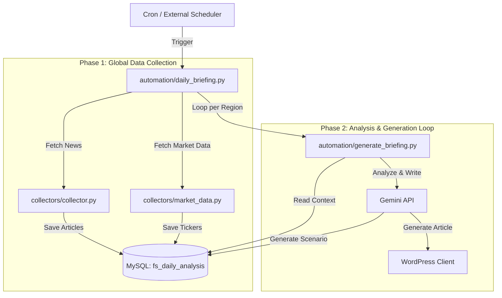

# Daily Briefing (市場分析) ロジック設計書

## 1. 概要と目的

### 1.1. プロジェクトのゴール
FinShiftのコアコンテンツとして、**「スイングトレーダーが毎朝必ずチェックする市場分析レポート (Daily Briefing)」** を自動生成するシステムを構築します。

### 1.2. ターゲット読者と提供価値
*   **ターゲット**: 数日〜数週間のポジションを持つ個人投資家（スイングトレーダー）。
*   **課題**: 「ニュースは読んだが、結局どう動けばいいかわからない」「情報が多すぎて整理できない」。
*   **提供価値 (Output)**:
    1.  **市場の振り返り**: 昨日の市場で「何が」最も重要だったかを一言で定義する。
    2.  **明日への示唆**: 指標の変化から「明日どうなる可能性が高いか」を論理的に予測する。
    3.  **アクションプラン**: 「もしAなら買い、Bなら様子見」という具体的な行動指針を提供する。

---

## 2. アーキテクチャ基本方針

### 2.1. N対1のアプローチ (Unified Workflow)
従来の `pipeline.py` (1記事対1記事) とは異なり、**複数のニュースと市場データを統合して1つの記事を作成する** 特別なフローを採用します。

> **原則:** 「全市場をごちゃ混ぜにしない」。
> インド株、日本株、US株、仮想通貨など、投資家が関心を持つ「市場（Region/Asset）」ごとに独立したブリーフィング記事を作成します。

### 2.2. システム構成図
既存の `pipeline.py` とは切り離し、専用のコントローラー `daily_briefing.py` を新設します。

---

## 3. 詳細処理フロー

### Phase 1: グローバル・データ収集 (Global Collection Phase)
全リージョンの生成に必要なデータを**最初に一括で収集**し、データベースにプールします。
これにより、API実行回数の削減と、クロスリージョンな分析（例：米国株の動向を日本株記事で参照）が可能になります。

1.  **ニュース収集**:
    *   全対象ソース（US, JP, CN, IN, ID, Crypto）のRSSから記事を取得。
    *   **重複排除**: URLハッシュを用いて、既に収集中・処理済みの記事はスキップ。
    *   **AIノイズ除去 (AI Relevance Check)**:
        *   RSSカテゴリやキーワードだけに頼ると、多言語（中国語、インドネシア語等）やカテゴリ未設定のフィードで精度が出ません。
        *   そのため、**Gemini 2.0 Flashなどの軽量・高速モデル**を使用し、各記事のタイトルとスニペットに対して「これは金融市場・経済に関連する記事か？」を判定させます。
        *   非経済（芸能、スポーツ、人事情報など）と判定された記事はDB保存時または抽出時にフラグを立てて除外します。
    *   **保存**: `fs_articles` テーブルにタイトル、要約、ソース、推定リージョン、および**Relevanceフラグ**を保存。
2.  **市場データ収集**:
    *   主要指数（S&P500, 日経平均, Nifty50等）、為替（USDJPY）、コモディティ（Gold, Oil）、金利（US10Y）の最新終値を取得。
        | テーブル名 | 役割 | ソース (生成元) | 主な内容 |
        |---|---|---|---|
        | **fs_market_snapshots** | 数値の証拠 | `market_data.py` (Yahoo Finance API) | NYダウ, ドル円, VIX, 米10年債利回り などのClose値 |
        | **fs_economic_events** | 未来の羅針盤 | `economic_calendar.py` (Yahoo Finance Scraping) | 重要経済指標（CPI, 雇用統計, FOMCなど）の日程と予測値 |
        | **fs_daily_analysis** | AI脳の記憶 | `daily_briefing.py` (Gemini Analysis Output) | その日の「市場ムード判定(Risk-On/Off)」「強気/弱気シナリオ」 |

### Phase 2: 分析と記事生成 (Analysis & Generation Phase)
以下の対象カテゴリ（Type）ごとにループ処理を実行します。
*   **対象**: `US-Market`, `JP-Market`, `China-Market`, `India-Market`, `Indonesia-Market`, `Crypto-Asset`

各ループ内での詳細ステップ:

1.  **コンテキスト構築 (Context Building)**:
    *   DBから「直近24時間」かつ「対象リージョンに関連する」ニュースを抽出。
    *   **※Scoring不要**: Single Article Pipelineとは異なり、個別の記事をスコアリングして選別することはしません。「全体として何が起きたか」を把握するため、収集したニュースの要約（Header/Summary）を可能な限り全てコンテキストとしてGeminiに入力します。
    *   *Global Newsの活用*: 対象が日本株だとしても、重要度の高いGlobalニュース（米国市場の動向など）はコンテキストに含める。
    *   最新の市場データ（前日比、RSI等）を取得。

2.  **トレンド分析 (AI Analysis)**:
    *   集めた情報をGeminiに渡し、以下の「中間分析データ」を生成させる（JSON出力）。
        *   **Market Sentiment**: 0-100のスコア（Fear & Greed）。
        *   **Primary Driver**: 市場を動かした最大の要因。
        *   **Scenarios**: 強気（Bull）と弱気（Bear）の分岐条件。
    *   この分析結果を `fs_daily_analysis` テーブルに保存（予実管理用）。

3.  **記事執筆 (Drafting)**:
    *   分析データを元に、ターゲット読者（スイングトレーダー）に刺さる構成で記事本文を執筆。
    *   構成要素:
        *   **Market Pulse**: 今日の結論。
        *   **Key Levels**: 重要な価格帯。
        *   **Deep Dive**: 個別材料の深掘り。
        *   **Actionable Insights**: 「明日どうするか」。

4.  **配信 (Publishing)**:
    *   WordPressへ下書き、または公開状態で投稿。
    *   アイキャッチ画像の生成（記事タイトルに基づく）。

---

## 4. コンポーネント仕様

### 4.1. Controller: `automation/daily_briefing.py`
全体の指揮者となる新規スクリプト。

*   **引数**:
    *   `--run-all`: 全フェーズ・全リージョンを実行（本番用）。
    *   `--phase [collect|analyze]`: フェーズ指定実行（デバッグ用）。
    *   `--region [US|JP|IN...]`: 特定リージョンのみ生成。
    *   `--dry-run`: WordPress投稿やDB書き込みを行わない。

### 4.2. Database Schema (`automation/db/init_db.py`)
MySQLに以下のテーブルを定義します。詳細は `docs/02_design/database_schema.md` に準拠します。

| テーブル名 | 用途 | 定義済カラム（抜粋） |
| :--- | :--- | :--- |
| **fs_articles** | ニュースプール | `id`, `url_hash`, `title`, `source`, `region`, `fetched_at`, `summary`, **`is_relevant`** |
| **fs_market_snapshots** | 数値の証拠 | `id`, `date`, `data_json`, `vix_close`, `spx_close`, `us10y_yield` |
| **fs_economic_events** | 未来の羅針盤 | `id`, `event_date`, `country`, `event_name`, `impact`, `description` |
| **fs_daily_analysis** | AI脳の記憶 | `id`, `date`, `region`, `sentiment_score`, `scenarios_json`, `full_briefing_md` |

### 4.3. Gemini Client (`automation/gemini_client.py`)
N対1分析用のメソッドを追加します。

*   `analyze_daily_market(context_news, market_data)`:
    *   ニュース群と数値データから、トレンドとシナリオを抽出するプロンプトを実行。
*   `write_briefing(analysis_result)`:
    *   分析結果JSONを元に、読み物としての記事本文（Markdown）を出力。

### 4.4. Collector (`automation/collectors/collector.py`)
リージョンごとのフィルタリング機能を追加します。

*   **機能追加**: 引数 `region` を受け取れるようにする。
*   **マッピング**:
    *   `US` -> `wsj`, `cnbc`, `techcrunch`
    *   `JP` -> `yahoo_jp_business`, `lnews`
    *   `Global` -> `reuters`, `bloomberg` ...
    *   ※ `collector.py` 内部でソースリスト定義を持つか、呼び出し元からソースリストを渡す形に変更。

---

## 5. 今後の拡張性 (Future Work)
*   **予実管理の自動化**: `fs_daily_analysis` に保存した「強気シナリオ」が実際に当たったかどうかを、翌日のデータと比較して自動採点し、プロンプトを自己改善する仕組み。
*   **パーソナライズ**: ユーザーの保有銘柄に合わせて、特定のニュースを強調表示する機能（Webアプリ側）。