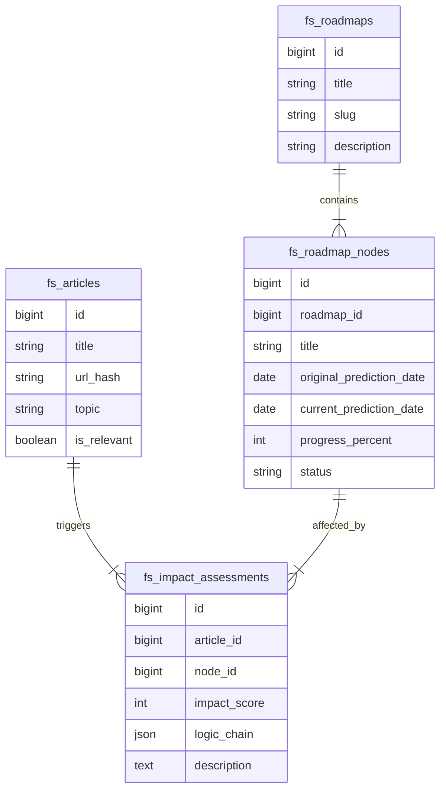

# TechShift データベース・スキーマ設計

## 概要
TechShiftの「Event-Driven Roadmap」を実現するためのデータベース設計です。
WordPressの既存DB (`wordpress`) 内に、`fs_` プレフィックスを持つカスタムテーブルを作成します。

## ER図 (概念)

---

## テーブル定義

### 1. `fs_articles` (News Pool)
収集したテックニュースを保存します。

| Column | Type | Description |
|---|---|---|
| `id` | BIGINT PK | |
| `url_hash` | CHAR(64) | URL SHA256 (Unique) |
| `title` | VARCHAR(512) | 記事タイトル |
| `source` | VARCHAR(100) | 出典元 (TechCrunch, arXiv, etc) |
| `published_at` | DATETIME | 公開日 |
| `topic` | VARCHAR(50) | 推定トピック (General AI, Space, etc) |
| `summary` | TEXT | コンテンツ要約 |
| `is_relevant` | BOOLEAN | 分析対象か否か (Noise Filter結果) |

### 2. `fs_roadmaps` (Roadmap Definitions)
親となるロードマップの定義（例：「生成AI進化論」「火星移住計画」）。

| Column | Type | Description |
|---|---|---|
| `id` | BIGINT PK | |
| `slug` | VARCHAR(100) | URLスラッグ (generative-ai, mars-mission) |
| `sector` | VARCHAR(50) | メイン区分 (Space, Quantum, AI, Robotics, Bio, Energy) | **Added: フロントページ分類用** |
| `title` | VARCHAR(255) | ロードマップ名 |
| `description` | TEXT | 概要 |
| `wp_page_id` | BIGINT | 対応するWordPress固定ページのID |

### 3. `fs_roadmap_nodes` (Milestones)
ロードマップ上の個々のマイルストーン（ノード）。

| Column | Type | Description |
|---|---|---|
| `id` | BIGINT PK | |
| `roadmap_id` | BIGINT FK | 親ロードマップID |
| `parent_node_id` | BIGINT FK | 親ノードID (階層化用) |
| `layer` | ENUM | `'regulation'`, `'technology'`, `'market'` |
| `node_type` | ENUM | `'floating'`, `'fixed'` |
| `region` | ENUM | `'global'` (Default), `'jp'` | **Added: 国内外比較用** |
| `global_node_id` | BIGINT FK | 自己参照FK. `region='jp'` の場合、対応するGlobalノードのIDを入れる |
| `title` | VARCHAR(255) | ノード名（例：GPT-5 Release） |
| `original_prediction_date` | DATE | 当初の予測時期 (Baseline) |
| `current_prediction_date` | DATE | 最新の予測時期（Impactにより変動） |
| `baseline_source` | VARCHAR(255) | 初期値の出典 (例: "IBM Quantum Roadmap 2024") |
| `confidence_score` | INT | 予測の確度 (0-100) |
| `status` | ENUM | 'pending', 'achieved', 'delayed' |

### 6. `fs_impact_assessments` (Signal & Analysis)
ロードマップ上の「Signal (ニュース)」と、それによる「Impact (分析結果)」を記録します。
Phase 1では主に「Signal Timeline」のためのニュース紐付けとして機能します。

| Column | Type | Description |
|---|---|---|
| `id` | BIGINT PK | |
| `article_id` | BIGINT FK | 元記事ID |
| `node_id` | BIGINT FK | 関連ロードマップ・ノードID |
| `impact_score` | INT | **[Phase 2]** -5 (Delay) 〜 +5 (Accelerate) |
| `logic_chain` | JSON | **[Phase 2]** 自動生成ロジック |
| `analysis_summary` | TEXT | 編集者による解説コメント (Timeline表示用) |
| `created_at` | DATETIME | 作成日時 |

### 7. `fs_tech_events` (Calendar)
確定している未来のイベント。

| Column | Type | Description |
|---|---|---|
| `id` | BIGINT PK | |
| `event_date` | DATE | イベント日 |
| `title` | VARCHAR(255) | イベント名 |
| `related_roadmap_id` | BIGINT | 関連ロードマップ (Optional) |

---

## 実装ノート
*   **WordPress連携**: `fs_roadmaps` はWPの固定ページと1対1で対応させると管理しやすい。
*   **履歴管理**: `fs_impact_assessments` を時系列で追えば、なぜ予測が変わったかの履歴（Lineage）が表示できる。
