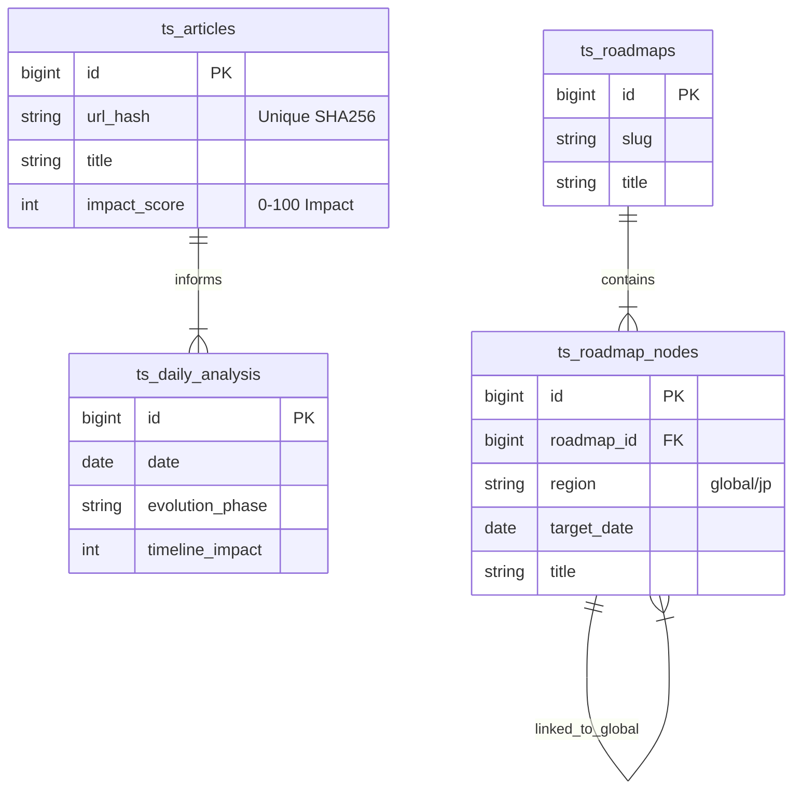

# TechShift Database Schema Design

## Overview
Database design for TechShift, focusing on "Daily Briefing" and "Event-Driven Roadmap".
Custom tables with `ts_` prefix are created within the WordPress database.

## ER Diagram

---

## Table Definitions

### 1. `ts_articles` (News Pool)
Stores collected tech news and their relevance.

| Column | Type | Description |
|---|---|---|
| `id` | BIGINT PK | |
| `url_hash` | CHAR(64) | URL SHA256 (Unique) |
| `title` | VARCHAR(512) | Article Title |
| `source` | VARCHAR(100) | Source Name (TechCrunch, etc) |
| `region` | VARCHAR(20) | Region Code (us, eu, jp, global) |
| `published_at` | DATETIME | Publish Date |
| `fetched_at` | DATETIME | Fetch Date |
| `summary` | TEXT | Content Summary |
| `is_relevant` | BOOLEAN | Relevance Flag (Filter Result) |
| `relevance_reason` | TEXT | Reason for Relevance |
| `impact_score` | INT | Impact Score (0-100). |

### 2. `ts_daily_analysis` (Briefing Data)
Stores the high-level analysis used for the Daily Briefing.

| Column | Type | Description |
|---|---|---|
| `id` | BIGINT PK | |
| `date` | DATE | Analysis Date |
| `region` | VARCHAR(10) | Target Region |
| `evolution_phase` | VARCHAR(50) | Current Tech Phase (e.g. "AI Implementation") |
| `timeline_impact` | INT | Impact Score (0-100). |
| `impact_label` | VARCHAR(20) | Label (Accelerated, Delayed, Neutral) |
| `hero_topic` | VARCHAR(255) | Most critical topic of the day |
| `scenarios_json` | JSON | Scenarios (Main, Bull, Bear) |
| `ai_structured_summary` | JSON | Structured Summary & Keywords |
| `full_briefing_md` | MEDIUMTEXT | Generated Markdown Content |
| `wp_post_id` | BIGINT | Associated WordPress Post ID |
| `created_at` | DATETIME | Creation Time |

### 3. `ts_calendar_events` (Tech & Macro Events)
Stores key future events (Tech Conferences, Policy Decisions, Earnings).

| Column | Type | Description |
|---|---|---|
| `id` | BIGINT PK | |
| `event_date` | DATE | Event Date |
| `event_name` | VARCHAR(255) | Event Name (e.g. "OpenAI DevDay") |
| `country` | VARCHAR(50) | Region/Country |
| `category` | VARCHAR(50) | 'Tech Release', 'Policy', 'Macro' |
| `impact_level` | VARCHAR(20) | High, Medium, Low |
| `description` | TEXT | Details |
| `source` | VARCHAR(50) | Source System |
| `created_at` | DATETIME | |

### 4. `ts_roadmaps` (Roadmap Definitions)
Master definition of a Technology Roadmap Topic.

| Column | Type | Description |
|---|---|---|
| `id` | BIGINT PK | |
| `slug` | VARCHAR(100) | URL Slug (e.g. `generative-ai`, `quantum-computing`) |
| `title` | VARCHAR(255) | Roadmap Name |
| `description` | TEXT | Overview |
| `wp_page_id` | BIGINT | Integration Page ID |
| `created_at` | DATETIME | |

### 5. `ts_roadmap_nodes` (Milestones & Dual Region)
Individual milestones on the roadmap. Supports Global vs JP structure.
Default roadmap data is stored here.

| Column | Type | Description |
|---|---|---|
| `id` | BIGINT PK | |
| `roadmap_id` | BIGINT FK | Parent Roadmap |
| `region` | VARCHAR(10) | `global` (Default) or `jp` |
| `global_node_id` | BIGINT FK | **[Mapping]** If `region='jp'`, links to corresponding global node to align rows. |
| `title` | VARCHAR(255) | Milestone Name (e.g. "4k Qubits") |
| `target_date` | DATE | **[Baseline]** Planned Realization Date |
| `display_date` | VARCHAR(50) | Display String (e.g. "2025 Q1") |
| `source` | VARCHAR(255) | Source of this baseline (e.g. "IBM Roadmap 2024") |
| `status` | ENUM | 'pending', 'achieved', 'delayed' |
| `progress` | INT | 0-100% |
